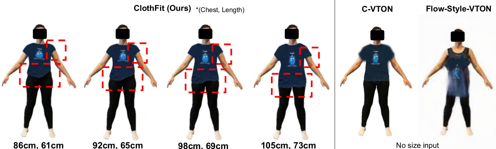
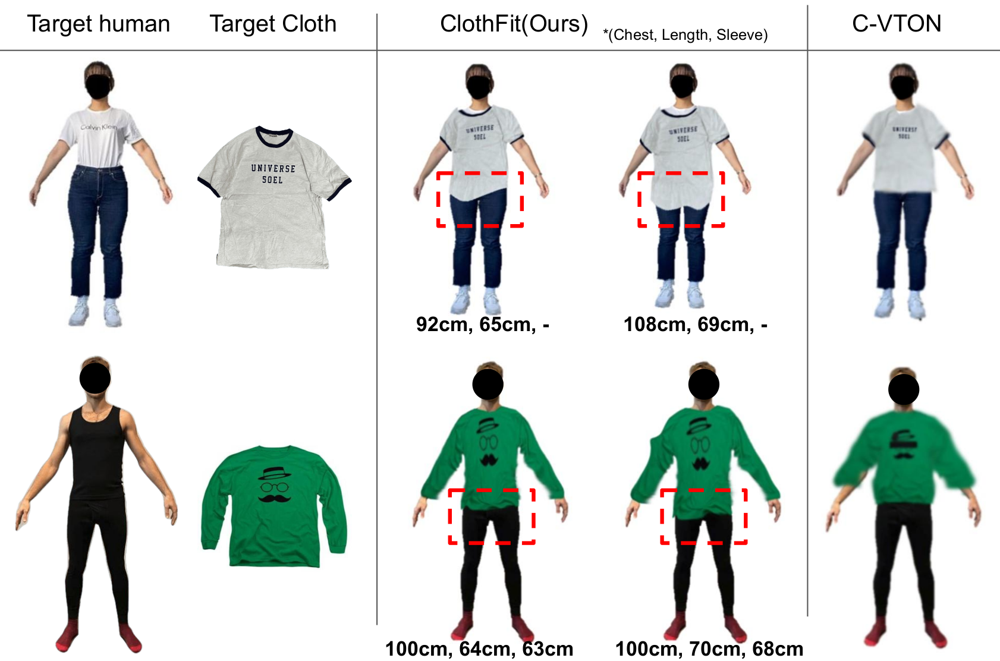

# CLOTHFIT: Cloth-Human-Attribute Guided Virtual Try-On Network Using 3D Simulated Dataset

## Paper
This paper is accepted in the IEEE ICIP 2023.
You can find the full paper at [arXiv](https://arxiv.org/pdf/2306.13908.pdf).

## Abstract
Online clothing shopping has become increasingly popular, but the high rate of returns due to size and fit issues has remained a major challenge. To address this problem, virtual try-on systems have been developed to provide customers with a more realistic and personalized way to try on clothing. In this paper, we propose a novel virtual try-on method called ClothFit, which can predict the draping shape of a garment on a target body based on the actual size of the garment and human attributes. Unlike existing try-on models, ClothFit considers the actual body proportions of the person and available cloth sizes for clothing virtualization, making it more appropriate for current online apparel outlets. The proposed method utilizes a U-Net-based network architecture that incorporates cloth and human attributes to guide the realistic virtual try-on synthesis. Specifically, we extract features from a cloth image using an auto-encoder and combine them with features from the user’s height, weight, and cloth size. The features are concatenated with the features from the U-Net encoder, and the U-Net decoder synthesizes the final virtual try-on image. Our experimental results demonstrate that ClothFit can significantly improve the existing state-of-the-art methods in terms of photo-realistic virtual try-on results.

## Dataset
We used our own synthetic datasets which were generated using Blender. 
There are 4 types of clothes: tshirt, longsleeve, dress and blazer.
The number of dataset is as follows:
| | tshirt | longsleeve | dress | blazer |
|---|---|---|---|---|
|Female|16000|16000|8000| - |
|Male|16000|16000| - | 8000 |

You can download part of the dataset from [here](https://drive.google.com/file/d/1UIaa6jkSu3cCLiG7brFyPJ6NXb72c8EY/view?usp=share_link).

## Requirements
- Python(3.8.10)
- opencv-python(4.7.0)
- torch(1.13.1+cu117)
- torchvision(0.14.1)
- [segmentation_models_pytorch](https://github.com/qubvel/segmentation_models.pytorch)
- scikit-learn(1.2.0)

<!--## Inference-->

## Acknowledgements
This work was supported by the BMBF (German Federal Ministry of Education and Research) in the VidGenSense (01IW21003). The Carl-Zeiss Stiftung also funded it under the Sustainable Embedded AI (P2021-02-009).
